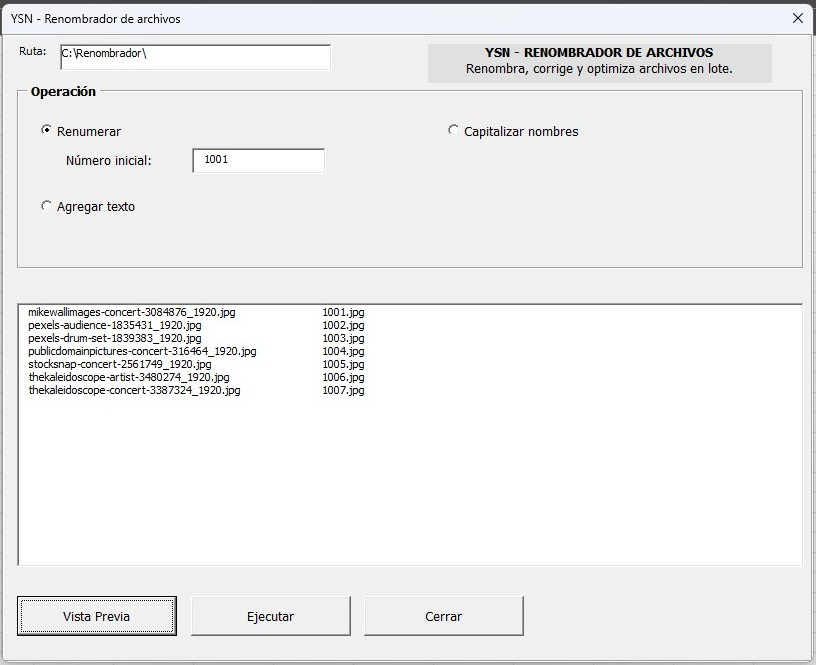
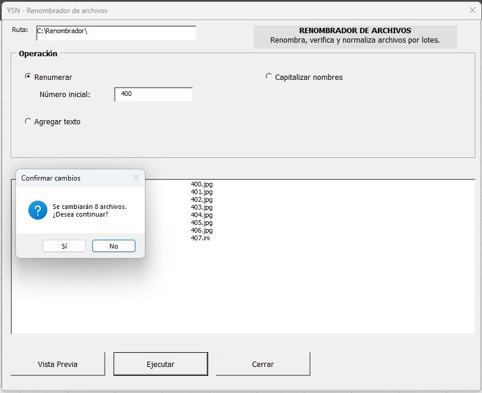
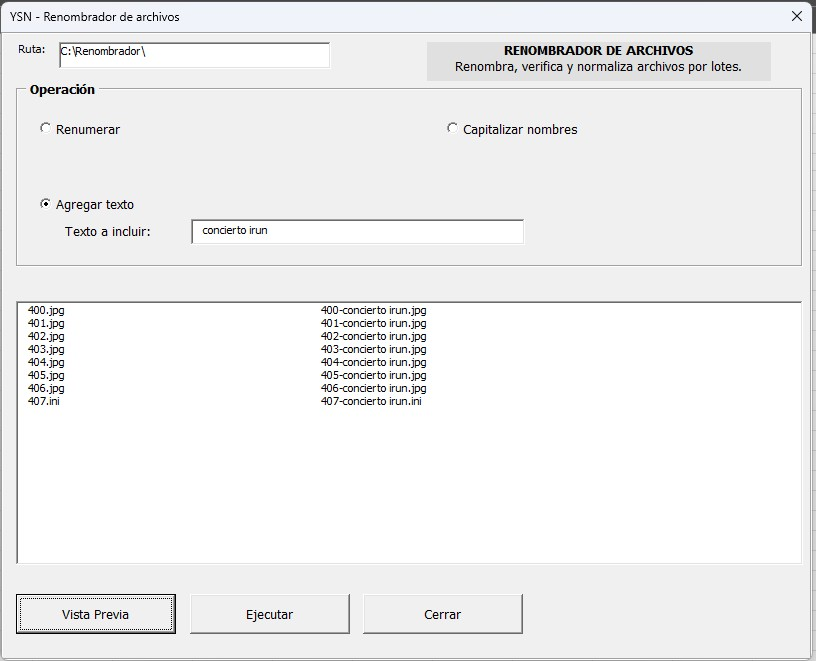
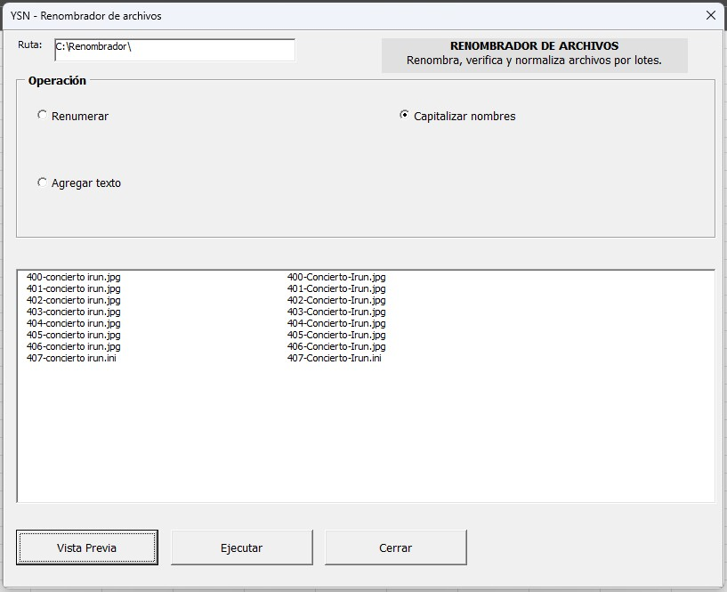
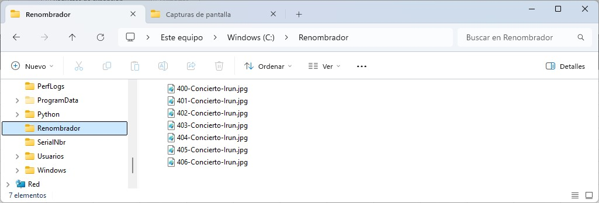
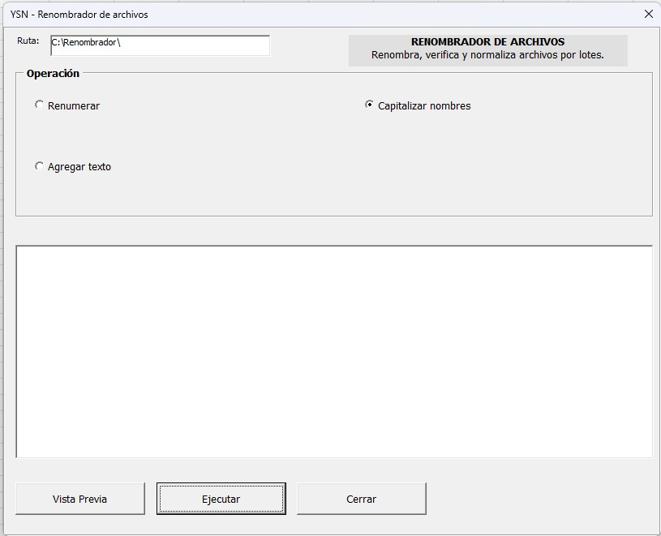

# Normalizador y renumerador de archivos

Herramienta creada para automatizar el renombrado, la revisión y la normalización de conjuntos de archivos. El proyecto surgió a partir de una necesidad real durante mi trabajo en un archivo municipal, donde era necesario tratar numerosos ficheros con nombres numéricos o formatos inconsistentes.

La primera versión funcional se desarrolló en **PowerShell**. Debido a que los controles de seguridad del entorno restringían la ejecución de scripts, la herramienta se adaptó posteriormente a **Microsoft Excel VBA**, manteniendo sus funciones principales y facilitando su uso en los equipos autorizados.

> Este repositorio documenta el funcionamiento técnico del proyecto. No contiene documentos, datos personales ni información interna del Ayuntamiento.

## Funcionalidades

### 1. Verificación y renumeración de secuencias

Analiza los identificadores numéricos de una carpeta y detecta posibles saltos en la secuencia.

```text
Secuencia encontrada: 10122, 10123, 10125
Número ausente:        10124
```

Tras la comprobación, el usuario puede indicar un número inicial y renumerar automáticamente todos los archivos a partir de ese valor, generando una secuencia correlativa y sin saltos.
<p align="center">
  <a href="docs/images/02-vista-previa-renumeracion.jpg">
    
  </a>
</p>

Una vez confirmada la operación, la aplicación informa al usuario de que el proceso ha finalizado.

<p align="center">
  <a href="docs/images/03-renumeracion-terminado.jpg">
    
  </a>
</p>

---

### 2. Renombrado descriptivo

Permite añadir un texto descriptivo después del identificador numérico de cada archivo, conservando el número original y su extensión.

```text
Antes:   10122.jpg
Después: 10122-Paco de Lucia Bilbao.jpg
```

<p align="center">
  <a href="docs/images/04-agregar-texto.jpg">
    
  </a>
</p>

---

### 3. Normalización de nombres

Corrige nombres escritos completamente en mayúsculas, en minúsculas o con una combinación irregular, aplicando un criterio uniforme de capitalización.

```text
10122-PACO-DE-LUCIA_BILBAO.jpg
10122_paco_de_lucia_bilbao.jpg
10122_PaCo_de_LuCia_BILBAO.jpg

Resultado normalizado:
10122-Paco-de-Lucia-Bilbao.jpg
```

<p align="center">
  <a href="docs/images/06-capitalizar-nombres.jpg">
    
  </a>
</p>

---

## Medidas de seguridad

La herramienta incorpora comprobaciones destinadas a reducir errores durante operaciones masivas:

- Trabajo exclusivo sobre copias ubicadas en una carpeta local denominada `RENOMBRADOR`.
- Separación entre el entorno de trabajo y la base de datos o repositorio documental original.
- Vista previa de los cambios antes de aplicarlos.
- Conservación de las extensiones originales.
- Detección y prevención de nombres duplicados.
- Posibilidad de cancelar antes de modificar los archivos.
- Procesamiento controlado de carpetas completas.

Aunque existen estas comprobaciones, se recomienda trabajar siempre sobre una copia de los archivos originales.

### Entorno de trabajo controlado

La aplicación estaba dirigida a personas sin conocimientos técnicos, por lo que se limitó deliberadamente su ámbito de actuación. Todas las operaciones debían realizarse dentro de una carpeta local llamada `RENOMBRADOR`; la herramienta no trabajaba directamente sobre la base de datos ni sobre el repositorio documental original.

Antes de iniciar el proceso, el usuario debía copiar a `RENOMBRADOR` únicamente los archivos que necesitaba modificar. El renombrado, la verificación de secuencias, la renumeración y la normalización se ejecutaban sobre esas copias. Este diseño reducía el riesgo de modificar archivos equivocados, perder información o afectar los datos originales.

<p align="center">
  <a href="docs/images/07-resultado-final.jpg">
    
  </a>
</p>

## Flujo de uso

1. Crear o localizar la carpeta local `RENOMBRADOR`.
2. Copiar a esa carpeta los archivos que se desean modificar.
3. Ejecutar la herramienta sobre el contenido de `RENOMBRADOR`.
4. Elegir la operación deseada.
5. Introducir el texto descriptivo cuando sea necesario.
6. Revisar la secuencia numérica y los posibles valores ausentes.
7. Consultar la vista previa de los nuevos nombres.
8. Confirmar o cancelar los cambios.

## Tecnologías

- **PowerShell:** utilizado para desarrollar el primer prototipo funcional.
- **Microsoft Excel VBA:** utilizado para adaptar la solución a las restricciones de ejecución del entorno.
- **Sistema de archivos de Windows:** lectura, validación y modificación de nombres de archivo.

## Interfaz de usuario

La versión en Excel VBA utiliza un formulario sencillo pensado para personas sin conocimientos informáticos. La ruta de trabajo está limitada a `C:\Renombrador` y la interfaz presenta tres operaciones claramente diferenciadas:

- **Renumerar**, indicando el número inicial.
- **Agregar texto**, introduciendo el texto que se añadirá al nombre.
- **Capitalizar nombres**, para aplicar un formato uniforme.

La zona central muestra la vista previa de los archivos y los botones inferiores permiten revisar los cambios, ejecutarlos o cerrar la herramienta.

<p align="center">
  <a href="docs/images/01-diseno-interfaz.jpg">
    
  </a>
</p>

## Competencias aplicadas

- Automatización de tareas repetitivas.
- Manipulación de archivos y extensiones.
- Validación de secuencias numéricas.
- Prevención y tratamiento de colisiones de nombres.
- Procesamiento por lotes.
- Diseño de un flujo seguro y sencillo para usuarios no técnicos.
- Separación entre los archivos de trabajo y los datos originales.
- Adaptación de una solución entre tecnologías.
- Resolución de problemas dentro de un entorno con controles de seguridad.

## Motivación

El renombrado manual de grandes cantidades de archivos consume tiempo y puede producir errores de escritura, numeración o formato. Esta herramienta permitió convertir ese proceso en un flujo guiado, verificable y repetible.

## Privacidad

Los nombres y números mostrados en esta documentación son ejemplos ficticios. El proyecto público no debe incluir archivos reales, datos personales, rutas internas, credenciales ni capturas con información municipal.

## Posibles mejoras

- Registro de operaciones y errores.
- Opción para deshacer el último cambio.
- Exportación de un informe con los nombres anteriores y nuevos.
- Compatibilidad con reglas de renombrado configurables.
- Pruebas automatizadas para secuencias y colisiones.

## Estado del proyecto

Proyecto funcional desarrollado para resolver una necesidad práctica. La documentación y el código publicado pueden adaptarse para utilizar exclusivamente datos de ejemplo.

## Autoría

Proyecto personal desarrollado como solución de automatización aplicada a un entorno profesional.
